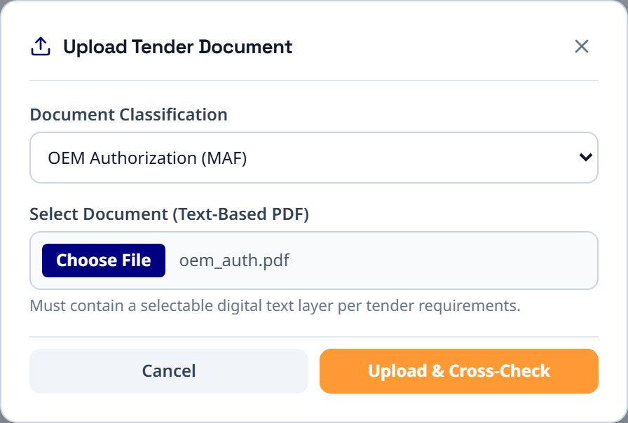
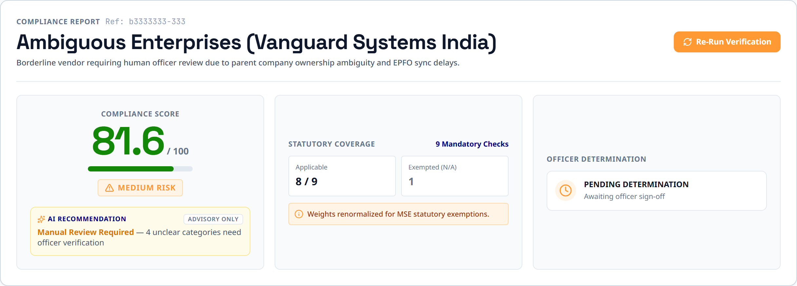
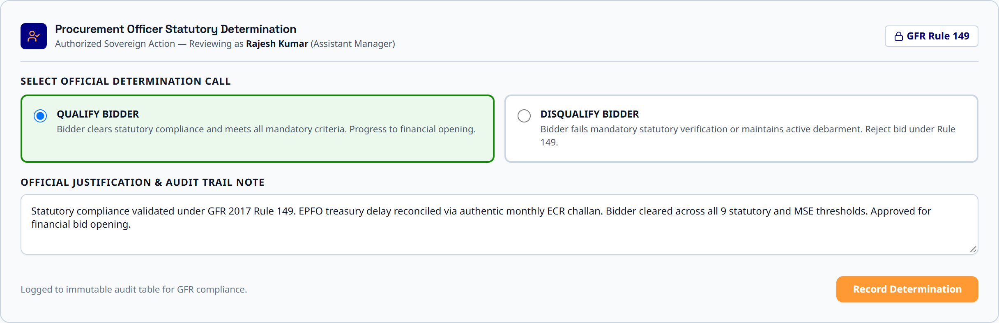

# 🇮🇳 EPSILON X — Statutory Bid Compliance Verification Platform
> **AI-Powered Sovereign Procurement Compliance & Tender Fraud Prevention Engine**  
> *Government e-Marketplace (GeM) | Smart India Hackathon (SIH 2026 — PS 26100)*  
> *Ministry of Petroleum & Natural Gas | Chennai Petroleum Corporation Limited (CPCL)*

---

## 📌 Executive Overview

**Epsilon X** is an enterprise-grade statutory compliance verification engine engineered for sovereign public procurement under **General Financial Rules (GFR) 2017 Rule 149**, the **Public Procurement Policy for Micro and Small Enterprises (MSEs)**, and the **Public Procurement (Preference to Make in India) Order (PPP-MII) 2017**.

The platform automates the verification of bidder eligibility by cross-referencing claims extracted from tender documents against simulated Central Government databases, watchdog watchlists, and statutory registries. It provides procurement officers with quantitative risk scoring, an automated AI statutory audit summary, longitudinal vendor reliability tracking, and tamper-evident audit certificates.

---

## 🏛️ Core Features

### 1. 9-Dimensional Statutory Evaluation Matrix
Each bidder is quantitatively scored using a weighted, renormalized compliance index evaluated against statutory schema definitions:

| Category | Sponsoring Authority / Schema Reference | Weight | Evaluation Method |
|---|---|:---:|---|
| **GeM Debarment / CVC Blacklist** | Central Vigilance Commission / GeM Watchlist | **25%** | Automated Watchlist Query (Simulated Portal Layer) |
| **GSTIN Registration & Filing** | GSTN Portal Registry Schema | **15%** | Auto-Synced Profile Data (Simulated Portal Layer) |
| **PAN & Income Tax Compliance** | CBDT / Income Tax Department Schema | **15%** | Auto-Synced Profile Data (Simulated Portal Layer) |
| **MSME / Udyam Registration** | Ministry of Micro, Small & Medium Enterprises | **10%** | Auto-Synced Profile Data (Simulated Portal Layer) |
| **Make in India (Local Content %)** | DPIIT / GeM Self-Declaration Schema | **10%** | Auto-Synced Profile Data (Simulated Portal Layer) |
| **EPFO & ESIC Compliance** | EPFO Unified Portal / ESIC Portal Schema | **10%** | Auto-Synced Profile Data (Simulated Portal Layer) |
| **Startup India / NSIC Recognition** | Startup India Hub / NSIC Registry Schema | **5%** | Tender Document Upload & Semantic Cross-Check |
| **OEM Authorization (MAF)** | Original Equipment Manufacturer Registry Schema | **5%** | Tender Document Upload & Semantic Cross-Check |
| **DigiLocker Certificate Verification** | Ministry of Electronics & IT (MeitY) Schema | **5%** | Cryptographic Hash Match & Integrity Verification |

#### Scoring Rules & Guardrails:
- **Dynamic Weight Renormalization**: If certain non-mandatory document categories are unsubmitted, remaining active statutory weights are renormalized to maintain a strict 100-point index.
- **Unclear Risk Floor**: If 3 or more categories return ambiguous or unverified status (`unclear`), the risk level is floored at **MEDIUM RISK** regardless of numerical score.
- **Blacklist Hard-Gate (Zero-Tolerance Security Gate)**: Any bidder failing the **GeM Debarment / CVC Blacklist** check is immediately hard-gated to **HIGH RISK**, regardless of numerical score (even if all other 8 categories pass).

> **Data Architecture Note**: The platform utilizes a simulated portal data layer (`data/mock-portal-data.json` and Supabase schema) with data contracts modeled directly after official government registries (GSTN, Udyam, CBDT, EPFO). This enables full offline/demonstration capability while being architected for turnkey integration with live production APIs.

---

### 2. Two-Stage AI Verification Pipeline
- **Prompt A (Structured Extraction)**: Deep text parsing of certificates, balance sheets, and statutory declarations into structured JSON schemas (`reference_id`, `claimed_dates`, `claimed_status`).
- **Prompt B (Portal Ground-Truth Cross-Check)**: Semantic verification comparing extracted bidder claims against central portal records to flag discrepancies, expired licenses, name/entity mismatches, and parent-company ownership ambiguities.
- **Model Orchestration**: Powered by Google Gemini (`gemini-3.5-flash-lite` / `gemini-1.5-flash`) with automatic, instant fallback to the deterministic AI simulation engine when offline.

---

### 3. Bidder Reliability Score & Past Bid History (GFR Rule 149)
- **Longitudinal Vendor Tracking**: Tracks vendor performance across historical tenders via the `bid_history` table (`bidder_id`, `tender_ref`, `score`, `risk_level`, `officer_decision`, `date`).
- **Advisory Reliability Score**: Computes a quantitative compliance percentage (e.g., `Reliability: 100% (3 of 3 past bids compliant)`) and tier rating:
  - **High Reliability** (≥80% compliant bids)
  - **Moderate Reliability** (50% – 79% compliant bids)
  - **Low Reliability** (<50% compliant bids)
- **Informational Safeguard**: Per GFR Rule 149 guidelines, historical reliability is purely advisory for procurement officers, providing longitudinal context without altering current 9-dimensional compliance scoring or overriding mandatory statutory checks.
- **Interactive UI & Badging**: Displayed via dedicated `ReliabilityBadge` components across both the Officer Dashboard and Bidder Detail page, complete with a full historical tender breakdown table.

---

### 4. Automated AI-Generated Statutory Audit Summary
- **Instant Auto-Compilation**: When a procurement officer makes a statutory determination, the system automatically compiles an executive statutory summary of verification results across all 9 portals.
- **Legally-Defensible Findings**: Synthesizes total evaluated categories, passed checks, failed checks, specific statutory citations (e.g., Section 29(2)(c) GST cancellations, CVC watchlist debarments), and GFR 149 threshold adherence.
- **Permanent Audit Trail**: The generated summary is permanently stored with the adjudication record and printed onto official audit certificates.

---

### 5. Officer Adjudication Console with Override Detection
- **Role-Based Profiles**: Pre-calibrated procurement officer profiles (**Assistant Manager**, **Deputy Manager**, **Senior Manager**) with realistic credential authorization.
- **Statutory Determinations**: Formal adjudication (**Qualify** / **Disqualify** / **Pending Review**) with mandatory justification notes and officer signature attribution.
- **Statutory Override Warning Banner**: If an officer's determination conflicts with the AI statutory recommendation (e.g., qualifying a high-risk vendor or disqualifying a low-risk vendor), the console displays a prominent warning banner.
- **Override Audit Flag**: Confirmed overrides permanently record `officer_override: true` in the database and display an amber `⚠ Override` indicator on the dashboard for executive oversight.

---

### 6. Official Audit Export & Compliance Reporting
- **Digitally Signed PDF Compliance Certificates**:
  - Official Government e-Marketplace header and emblem styling.
  - Officer determination and digital signature block with adjudicator name, designation, timestamp, and verification hash.
  - Prominent **Officer Override Warning Box** if the adjudicator diverged from AI statutory recommendations.
  - Complete **AI-Generated Statutory Audit Summary** block.
  - **Bidder Reliability Score & Past Bid History** breakdown (marked as GFR 149 Informational Only).
  - Full tabular breakdown of all 9 statutory categories, reference IDs, and verification statuses.
- **Structured CSV Audit Reports**: Machine-readable audit logs containing complete adjudication metadata, timestamps, and statutory findings for central vigilance integration.

---

### 7. Dual Execution Engine (Live + Offline Fallback)
- **Live Mode**: Backed by **Supabase PostgreSQL** and **Google Gemini AI** for persistent storage and live document reasoning.
- **Local Fallback Mode**: Built-in zero-dependency simulated portal datasets (`data/mock-portal-data.json`) and a deterministic AI simulation engine, ensuring seamless live demonstrations even in air-gapped or low-connectivity environments.

---

## 🖼️ Application Showcase

| Workflow Phase | Interface Preview |
|---|---|
| **1. Document Ingestion & Verification Setup** |  |
| **2. 9-Dimensional Matrix & Discrepancy Analysis** |  |
| **3. Officer Decision Console & Reliability Tracking** |  |

---

## 🛠️ Architecture & Tech Stack

```
epsilon-x/
├── client/                             # Frontend SPA (React + Vite + Vanilla CSS / Tailwind)
│   ├── public/                         # Visual assets (epx.png, indemb.png, login-bg.png)
│   ├── src/
│   │   ├── components/                 # Header, Footer, StatusBadge, RiskBadge, ReliabilityBadge, UploadModal
│   │   ├── pages/                      # OfficerLoginPage, DashboardPage, BidderDetailPage, NewBidderPage
│   │   └── utils/                      # officerAuth.js, auditSummary.js
├── server/                             # Backend API (Node.js + Express)
│   ├── scripts/                        # seedData.js, generateSamplePdfs.js, captureScreenshots.js, verifyScoring.js
│   ├── src/
│   │   ├── prompts/                    # Prompt A (Extraction) & Prompt B (Verification)
│   │   ├── routes/                     # api.js (REST endpoints)
│   │   └── services/                   # geminiService, dbService, scoringService, reliabilityService, auditSummaryService, exportService, pdfService
├── supabase/                           # Database Migrations & SQL Scripts
│   ├── add_bid_history_table.sql       # Bid history table schema and seed data
│   ├── add_audit_summary_and_override_columns.sql # Schema updates for audit summaries and override tracking
│   └── enable_rls.sql                  # Row-Level Security policies
├── screenshots/                        # High-resolution application captures and presentation cards
├── samples/                            # Pre-generated statutory PDFs for canonical demo profiles
└── data/                               # mock-portal-data.json (simulated central portal database)
```

- **Frontend**: React 18, Vite, TailwindCSS, Lucide React, HTML5 Canvas.
- **Backend**: Node.js (ES Modules), Express, `@supabase/supabase-js`, `@google/generative-ai`.
- **Document & PDF Processing**: `pdf-parse`, `pdf-lib`, `pdfkit`.
- **Testing & Automation**: Playwright, Node Test Runner.

---

## 🔌 API Reference

| Method | Endpoint | Description |
|---|---|---|
| `GET` | `/api/bidders` | List all registered bidders with latest compliance score, risk level, and reliability score |
| `GET` | `/api/bidders/:id` | Retrieve full bidder profile, 9-category breakdown, score, and bid history |
| `POST` | `/api/bidders` | Register a new vendor profile with initial statutory claims |
| `POST` | `/api/bidders/:id/upload` | Upload statutory tender document (PDF) for a category and execute Prompt A |
| `POST` | `/api/bidders/:id/verify` | Execute Prompt B cross-verification against government portal registry |
| `POST` | `/api/bidders/:id/decision` | Record officer adjudication (`officer_decision`, `officer_note`, `officer_name`, `ai_audit_summary`, `officer_override`) |
| `GET` | `/api/bidders/:id/history` | Retrieve longitudinal past bid history and compute reliability index |
| `GET` | `/api/bidders/:id/export/pdf` | Generate and download signed PDF Compliance Certificate |
| `GET` | `/api/bidders/:id/export/csv` | Download structured CSV audit trail report |
| `POST` | `/api/reset` | Restore the 3 canonical demo profiles, reset decisions to pending, and restore baseline history |

---

## 🧪 Pre-Calibrated Demonstration Profiles

The platform includes three pre-calibrated bidder profiles representing the complete statutory compliance spectrum:

### 1. Bharat Tech Solutions Pvt Ltd (`compliant`)
- **Compliance Score**: `100 / 100` | **Risk Level**: `LOW RISK`
- **Reliability Score**: `100%` (3 of 3 past bids compliant — High Reliability)
- **Profile Summary**: Exemplary sovereign vendor with active GSTIN, operative PAN, valid MSME Udyam, Class-I MII (65% local content), verified EPFO/ESIC, valid OEM MAF, and matching DigiLocker cryptographic hash.
- **AI Recommendation**: `Qualify`

### 2. Apex Global Traders LLP (`non_compliant`)
- **Compliance Score**: `60 / 100` | **Risk Level**: `HIGH RISK` *(Blacklist Hard-Gated)*
- **Reliability Score**: `33%` (1 of 3 past bids compliant — Low Reliability)
- **Profile Summary**: High-risk vendor with active GeM Debarment / CVC Blacklist record, cancelled GSTIN under Section 29(2)(c), inoperative PAN, and counterfeit OEM authorization letter.
- **AI Recommendation**: `Disqualify`

### 3. Vanguard Systems India (`ambiguous`)
- **Compliance Score**: `81.6 / 100` | **Risk Level**: `MEDIUM RISK` *(Unclear Risk Floor Applied)*
- **Reliability Score**: `67%` (2 of 3 past bids compliant — Moderate Reliability)
- **Profile Summary**: Borderline vendor requiring human officer adjudication. Unresolved parent company ownership ambiguity, pending EPFO treasury sync, and unconfirmed Class-II local content declaration.
- **AI Recommendation**: `Review Required`

> Clicking **"Reset Profiles"** on the dashboard restores these three canonical baselines, cleans test uploads, resets bid history, and returns all adjudication decisions to **Pending Review**.

---

## 🚀 Getting Started

### 1. Prerequisites
- **Node.js** (v18.0.0 or higher)
- **npm** (v9.0.0 or higher)

### 2. Installation
Clone the repository and install dependencies:

```bash
# Clone repository
git clone https://github.com/omprabhat21/epsilon-x.git
cd epsilon-x

# Install root, server, and client dependencies
npm install
npm --prefix server install
npm --prefix client install
```

### 3. Environment Configuration
Copy `.env.example` to `.env`:

```bash
cp .env.example .env
```

Configure your credentials (optional — the platform operates automatically in local fallback mode if credentials are omitted):

```ini
SUPABASE_URL=https://your-project.supabase.co
SUPABASE_SECRET_KEY=your-supabase-secret-key
GEMINI_API_KEY=your-gemini-api-key
PORT=5000
```

### 4. Database Setup (Optional for Supabase Live Mode)
If using Supabase, execute the migration scripts in the `supabase/` directory via the Supabase SQL Editor:
1. `supabase/add_bid_history_table.sql`
2. `supabase/add_audit_summary_and_override_columns.sql`
3. `supabase/enable_rls.sql`

### 5. Running the Application

```bash
# Terminal 1: Backend API Server (http://localhost:5000)
npm run server

# Terminal 2: Frontend Client (http://localhost:5173)
npm run client
```

Navigate to **`http://localhost:5173`** in your browser.

---

## 🔬 Automated Testing & Verification

Run the integration test suite and scoring verification scripts:

```bash
# Run end-to-end integration test suite (6 tests)
npm test

# Run statutory scoring and blacklist hard-gate verification
node server/scripts/verifyScoring.js
```

---

## 📜 Statutory & Regulatory Framework

- **General Financial Rules (GFR) 2017 — Rule 149**: Mandatory procurement of common use Goods and Services through GeM.
- **Public Procurement Policy for MSEs Order 2012**: Mandatory statutory procurement reservations and exemptions for Micro & Small Enterprises.
- **Public Procurement (Preference to Make in India) Order (PPP-MII) 2017**: Local content thresholds (Class-I: ≥50%, Class-II: ≥20%).
- **Central Vigilance Commission (CVC) Debarment Guidelines**: Zero-tolerance mandatory exclusion of blacklisted vendors.
- **Central Goods and Services Tax Act 2017 (Section 29)**: Cancellation and suspension of GSTIN registrations.

---

## 📄 License & Attribution

Developed for the **Smart India Hackathon (SIH 2026)** — Problem Statement 26100.  
All rights reserved.
