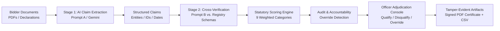

# 🇮🇳 EPSILON X — Sovereign Bid Compliance Verification Platform
> **AI-Powered Sovereign Procurement Compliance & Tender Fraud Prevention Engine**  
> *Government e-Marketplace (GeM) | Smart India Hackathon (SIH 2026 — Problem Statement 26100)*  
> *Ministry of Petroleum & Natural Gas | Chennai Petroleum Corporation Limited (CPCL)*  
> **Team:** The Outlaws *(Team ID: 168447)*  
> **Core Motto:** *"Never hides doubt. Never hides who decided."*

---

[](https://sih.gov.in)
[](https://sih.gov.in)
[](https://mopng.gov.in)
[-navy.svg?style=for-the-badge)](https://github.com/omprabhat21/epsilon-x)
[]()
[]()

---

## 📌 Executive Summary

On the **Government e-Marketplace (GeM)**, procurement volume surpassed **₹5 Lakh Crore GMV across 75.7 Lakh orders (FY 2025–26)**. Every single public tender requires procurement officers to manually cross-verify bidder claims across at least 9 fragmented statutory databases, tax registries, and debarment lists.

This manual process is:
1. **Slow and repetitive** (~45 minutes per bid evaluation).
2. **Vulnerable to oversight** (expired licenses, cancelled GSTINs, collusive shell companies).
3. **Risk-prone** when black-box AI tools hallucinate or make unaccountable decisions.

**Epsilon X** transforms this workflow into an **automated, evidence-based, explainable verification pipeline** that delivers a **60–80% reduction in verification effort** while strictly adhering to **General Financial Rules (GFR) 2017 Rule 149**, the **Public Procurement Policy for MSEs Order 2012**, and the **Make in India (PPP-MII) Order 2017**.

```
              ┌─────────────────────────────────────────────────────────┐
              │      AI ASSISTS.  RULES VERIFY.  OFFICER DECIDES.       │
              └─────────────────────────────────────────────────────────┘
```

---

## 🏛️ System Architecture

Epsilon X decouples non-deterministic LLM reasoning from deterministic statutory verification rules:



---

## 🌟 Core Innovations & Distinctive Features

### 1. 9-Dimensional Statutory Evaluation Matrix
Each bidder is quantitatively evaluated across 9 statutory dimensions with dynamic weight renormalization:

| Category | Authority / Statutory Source | Statutory Basis | Weight | Verification Method |
|---|---|---|:---:|---|
| **GeM Debarment / CVC Blacklist** | Central Vigilance Commission | CVC Debarment Guidelines | **25%** | Automated Watchlist Query *(Hard-Gated)* |
| **GSTIN Registration & Filing** | GSTN Portal Registry | CGST Act 2017 (Sec 29) | **15%** | Return filing periodicity & Active status |
| **PAN & Income Tax Compliance** | CBDT / Income Tax Department | IT Act 1961 | **15%** | PAN operative status & link check |
| **MSME / Udyam Registration** | Ministry of MSME | MSMED Act 2006 | **10%** | Enterprise classification & validity |
| **Make in India (Local Content %)**| DPIIT / GeM Self-Declaration | PPP-MII Order 2017 | **10%** | Class-I (≥50%) vs Class-II (20–49%) |
| **EPFO & ESIC Compliance** | EPFO / ESIC Portals | EPF & MP Act 1952 | **10%** | Monthly ECR return reconciliation |
| **Startup India / NSIC Recognition**| Startup India / NSIC | DIPP Recognition Schema | **5%** | Tender Document Upload & Verify |
| **OEM Authorization (MAF)** | OEM Partner Registry | GeM MAF Guidelines | **5%** | Direct OEM authorization validation |
| **DigiLocker Verification** | MeitY DigiLocker | IT Act 2000 (Sec 4) | **5%** | Cryptographic hash match |

---

### 2. Built-In Statutory Guardrails (Zero Hallucination)
- **Zero-Tolerance Blacklist Hard-Gate:** Any vendor failing the **GeM Debarment / CVC Blacklist** check is immediately hard-gated to **HIGH RISK**, regardless of numerical score (even if the remaining 8 categories achieve 100%).
- **Unclear Risk Floor:** In sovereign procurement, uncertainty is risk. If **3 or more categories** return ambiguous or unverified evidence (`unclear`), the risk level is floored at **MEDIUM RISK**, preventing ambiguous vendors from being classified as Low Risk.
- **Dynamic Weight Renormalization:** If a non-mandatory category is exempt (e.g. MSE exemptions for established enterprises), remaining statutory weights are proportionally renormalized to maintain an exact 100-point index.

---

### 3. Officer Adjudication Console & Accountability Loop
- **Human-in-the-Loop Sovereign Adjudication:** Per GFR Rule 149, the authorized procurement officer retains 100% legal adjudication authority.
- **Statutory Override Detection:** If an officer's determination diverges from the AI statutory recommendation (e.g., qualifying a High Risk vendor), the console presents an amber **Statutory Override Warning Banner**.
- **Permanent Override Flag:** Confirmed overrides permanently record `officer_override: true`, officer profile attribution, and mandatory justification notes onto the immutable audit record.

---

### 4. Longitudinal Vendor Reliability Score (GFR Rule 149)
- Tracks longitudinal vendor performance across historical tenders via the `bid_history` ledger.
- **Informational Safeguard:** Past reliability is strictly advisory for procurement officers, providing longitudinal context without altering current 9-dimensional compliance scoring or overriding mandatory statutory checks.

---

### 5. Digitally Hashed Audit Certificates (PDF & CSV)
- **PDF Certificate:** Official Government e-Marketplace styling, cryptographic verification hash, officer signature block, prominent **Officer Override Warning Box**, and AI-generated statutory summary.
- **CSV Audit Log:** Machine-readable tabular audit record for Central Vigilance Commission (CVC) oversight and CAG audit defense.

---

### 6. Dual Execution Engine (Live + Zero-Dependency Fallback)
- **Live Mode:** Powered by **Supabase PostgreSQL** and **Google Gemini AI** for persistent storage and semantic document reasoning.
- **Local Fallback Mode:** Built-in simulated portal registry (`data/mock-portal-data.json`) and a deterministic AI simulation engine, ensuring uninterrupted live demonstrations even in air-gapped or low-connectivity jury rooms.

---

## 🖼️ Application Showcase

| Workflow Phase | Interface Preview | Key Capabilities |
|---|---|---|
| **1. Document Ingestion** |  | Multimodal tender ingestion, non-OCR text parsing, structured claim extraction. |
| **2. 9-Dimensional Matrix** |  | Category-by-category claim vs. portal ground-truth cross-referencing and dynamic scoring. |
| **3. Officer Adjudication** |  | GFR 149 determination console, override warning banner, and longitudinal reliability tracking. |

---

## 🧪 Pre-Calibrated Demo Profiles

The platform includes three pre-calibrated bidder profiles representing the complete statutory compliance spectrum:

| Bidder Profile | Score & Risk | Reliability | Statutory Status | Key Audit Finding |
|---|:---:|:---:|---|---|
| **Bharat Tech Solutions Pvt Ltd** | **100 / 100**<br/>`LOW RISK` | **100%** *(High)* | Fully Compliant | Cleared across all 9 statutory portals; Class-I MII vendor (65% local content). |
| **Apex Global Traders LLP** | **60 / 100**<br/>`HIGH RISK` | **33%** *(Low)* | Non-Compliant | **Debarred by CVC** *(Hard-Gated)*; Section 29(2)(c) GST cancellation; Inoperative PAN. |
| **Vanguard Systems India** | **81.6 / 100**<br/>`MEDIUM RISK` | **67%** *(Moderate)* | Ambiguous | **3+ Unclear Risk Floor Applied**; Unresolved parent ownership ambiguity; Tier-2 MAF. |

> **Reset Baseline:** Clicking **"Reset Profiles"** on the dashboard restores these three baselines, cleans test uploads, and returns all adjudication decisions to **Pending Review**.

---

## 🛠️ Tech Stack & Directory Structure

```
epsilon-x/
├── client/                             # Frontend SPA (React 19, Vite, Tailwind CSS, Lucide Icons)
│   ├── public/                         # Official emblems, flags, background assets
│   ├── src/
│   │   ├── components/                 # StatusBadge, RiskBadge, ReliabilityBadge, UploadModal, Header, Footer
│   │   ├── pages/                      # OfficerLoginPage, DashboardPage, BidderDetailPage, NewBidderPage
│   │   └── utils/                      # officerAuth.js, auditSummary.js
├── server/                             # Backend REST API (Node.js ES Modules, Express)
│   ├── scripts/                        # seedData.js, generateSamplePdfs.js, captureScreenshots.js, verifyScoring.js
│   ├── src/
│   │   ├── prompts/                    # Prompt A (Extraction) & Prompt B (Verification)
│   │   ├── routes/                     # api.js (REST endpoints)
│   │   └── services/                   # geminiService, dbService, scoringService, reliabilityService, auditSummaryService, exportService, pdfService
├── supabase/                           # PostgreSQL Migrations & Row-Level Security
│   ├── add_bid_history_table.sql       # Longitudinal past bid schema
│   ├── add_audit_summary_and_override_columns.sql # Schema updates for audit summaries and override tracking
│   └── enable_rls.sql                  # Row-Level Security policies
├── samples/                            # Pre-generated canonical PDFs for compliant, non-compliant & ambiguous profiles
├── screenshots/                        # High-resolution application captures
└── data/                               # mock-portal-data.json (simulated central portal registry)
```

---

## ⚡ Quickstart Guide (Run Locally in 2 Minutes)

### Prerequisites
- **Node.js:** v18.0.0 or higher
- **npm:** v9.0.0 or higher

### 1. Clone & Install
```bash
git clone https://github.com/omprabhat21/epsilon-x.git
cd epsilon-x

# Install dependencies across root, server, and client
npm install
npm --prefix server install
npm --prefix client install
```

### 2. Environment Setup (Optional)
The system works out-of-the-box in **Local Fallback Mode** without any API keys.  
To connect to live cloud services, configure `.env`:
```bash
cp .env.example .env
```
```ini
SUPABASE_URL=https://your-project.supabase.co
SUPABASE_SECRET_KEY=your-supabase-secret-key
GEMINI_API_KEY=your-gemini-api-key
PORT=5000
```

### 3. Launch Application
```bash
# Terminal 1: Backend Server (http://localhost:5000)
npm run server

# Terminal 2: Frontend Client (http://localhost:5173)
npm run client
```

Navigate to **`http://localhost:5173`** in your browser.

---

## 🔬 Automated Testing & Scoring Verification

Run the end-to-end integration test suite verifying scoring logic, weight renormalization, blacklist hard-gating, PDF parsing, and reliability tracking:

```bash
# Execute automated test suite (6/6 tests passing)
npm test

# Run standalone statutory scoring validation
node server/scripts/verifyScoring.js
```

---

## 📜 Statutory & Legal Framework

- **General Financial Rules (GFR) 2017 — Rule 149:** Mandatory procurement of common use goods and services through GeM.
- **Public Procurement Policy for Micro & Small Enterprises (MSEs) Order 2012:** Mandatory 25% procurement target and tender document exemptions.
- **Public Procurement (Preference to Make in India) Order (PPP-MII) 2017:** Local content definitions (Class-I ≥50%, Class-II 20%–49%).
- **Central Vigilance Commission (CVC) Consolidated Guidelines:** Mandatory debarment and blacklisting enforcement.
- **Central Goods & Services Tax (CGST) Act 2017 (Section 29):** Tax compliance and registration suspension provisions.

---

## 👥 Team & Submission Information

- **Smart India Hackathon 2026**
- **Problem Statement ID:** SIH26100
- **Theme:** Smart Automation / Public Procurement
- **Sponsoring Agency:** Ministry of Petroleum & Natural Gas (MoPNG) / Chennai Petroleum Corporation Limited (CPCL)
- **Team Name:** The Outlaws *(Team ID: 168447)*
- **Team Leader:** Om Prabhat ([omprabhat21@gmail.com](mailto:omprabhat21@gmail.com))
- **Repository:** [https://github.com/omprabhat21/epsilon-x](https://github.com/omprabhat21/epsilon-x)

---

## 📄 License & Intellectual Property

```
Copyright (c) 2026 Om Prabhat & Team The Outlaws (Team ID: 168447).
Developed exclusively for Smart India Hackathon 2026 (Problem Statement SIH26100).
All rights reserved. Unauthorized reproduction, plagiarism, or commercial distribution is strictly prohibited.
```
